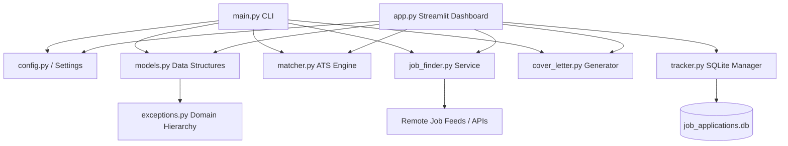

# 🩺 JobsFind: Enterprise Career Navigator & ATS Job Matcher

[](https://github.com/swaroop22/jobsfind/actions)
[](https://www.python.org/downloads/)
[](https://github.com/astral-sh/ruff)
[](https://docs.pytest.org/)

An enterprise-grade Python career navigation, ATS matching engine, and application management suite tailored for **Sri Lakshmi Sravya Reddy Kovvuri**. Highlights her unique value proposition: **AAPC Certified Professional Coder (CPC)** + **Former Dentist (BDS)**.

---

## 🏛️ Architecture & Enterprise Standards

JobsFind adheres to enterprise software engineering standards:



- **12-Factor Configuration**: Centralized `Settings` loaded via environment variables (`JOBSFIND_*`) with clean defaults.
- **Observability & Logging**: Structured logging (`logging` module) across all modules replacing raw prints and silent exceptions.
- **Domain Exception Hierarchy**: Custom domain exceptions (`ProfileError`, `DatabaseError`, `ExternalAPIError`) with clean boundaries.
- **Connection Safety**: Context managers ensuring SQLite transactions commit, roll back on errors, and always close to prevent file descriptor leaks.
- **Resilient Network Layer**: HTTP session pooling with automated exponential backoff and retry strategy (`urllib3.util.retry.Retry`).
- **Comprehensive Testing**: Full test suite built on `pytest` covering models, scoring, database operations, HTTP fallback, and narrative generation.
- **Continuous Integration**: GitHub Actions automated pipeline testing against Python 3.9, 3.10, and 3.11.

---

## 🌟 Key Modules

1. **Intelligent ATS Resume Matcher (`matcher.py`)**
   - Automatically scores any job description (0–100%) against credentials, coding standards, and clinical experience.
   - Highlights **competitive edges** (e.g. dental clinical expertise for dental billing, provider chart review for CDI).
   - Identifies matched competencies and flags missing keywords.

2. **Job Search & Aggregator (`job_finder.py`)**
   - Pre-loaded with curated healthcare opportunities across Ohio (Cleveland Clinic, OhioHealth, Premier Health Dayton, Dayton Children's, UC Health) and national remote employers (Optum, Elevance Health, Heartland Dental).
   - Resilient integration with live remote job feeds with retry backoff and offline fallback.
   - Filtering by category and location.

3. **Tailored Cover Letter Generator (`cover_letter.py`)**
   - Dynamically articulates the distinctive story: combining hands-on diagnostic dentistry with AAPC CPC coding accuracy.
   - Dynamically injects candidate contact information and employer-specific requirements.

4. **Application Tracker (`tracker.py`)**
   - SQLite database (`job_applications.db`) for tracking opportunities across stages: *Saved*, *Applied*, *Interviewing*, *Offer*, *Rejected*.
   - View KPIs, manage notes, and export to CSV.

5. **Interactive Web Dashboard (`app.py`)**
   - Streamlit UI with tabs for exploring jobs, testing ATS match scores, generating cover letters, tracking applications, and viewing skills matrix.

6. **CLI Utility (`main.py`)**
   - Terminal commands for searching, scoring job descriptions, and generating letters with standard exit codes.

---

## 🚀 Getting Started

### 1. Environment Setup

```bash
# Clone and enter directory
cd jobsfind

# Create virtual environment (Python 3.9+)
python3 -m venv .venv
source .venv/bin/activate

# Install dependencies
pip install --upgrade pip
pip install -r requirements.txt
```

### 2. Configuration (Optional)

Copy `.env.example` to `.env` to customize settings:

```bash
cp .env.example .env
```

| Environment Variable | Default | Description |
|----------------------|---------|-------------|
| `JOBSFIND_PROFILE_PATH` | `resume_profile.json` | Path to candidate resume profile JSON |
| `JOBSFIND_DB_PATH` | `job_applications.db` | Path to SQLite applications database |
| `JOBSFIND_LOG_LEVEL` | `INFO` | Logging verbosity (`DEBUG`, `INFO`, `WARNING`, `ERROR`) |
| `JOBSFIND_HTTP_TIMEOUT` | `5` | Network timeout for remote job feeds (seconds) |
| `JOBSFIND_MAX_RETRIES` | `3` | Maximum retry attempts for external requests |

### 3. Launch the Web Application

```bash
streamlit run app.py
```
*Access the dashboard in your browser at `http://localhost:8501`.*

---

## 💻 CLI Usage

```bash
# View Candidate Profile & Credentials
python main.py profile

# Search Jobs with Filters
python main.py search
python main.py search --location "Ohio Only"
python main.py search --category "Dental Coding & Cross-Coding"
python main.py search --keywords "dental"

# Match a Job Description Against Resume
python main.py match --title "Outpatient Coder" --company "Mercy Health" --text "Looking for a CPC certified coder with ICD-10 and CPT experience..."
python main.py match --file path/to/job_description.txt

# Generate a Tailored Cover Letter
python main.py cover-letter --id oh-cc-001
python main.py cover-letter --id rem-dent-004 --save Heartland_Cover_Letter.txt
```

---

## 🧪 Testing & Quality Assurance

Run the automated test suite with `pytest`:

```bash
pytest -v tests/
```

Run linting and formatting checks:

```bash
ruff check .
```

---

## 📁 Repository Structure

```
jobsfind/
├── .github/
│   └── workflows/
│       └── ci.yml               # Automated GitHub Actions CI workflow
├── tests/                       # Enterprise Pytest suite
│   ├── __init__.py
│   ├── conftest.py              # Shared fixtures (temp DB, profile fixtures)
│   ├── test_config.py           # Configuration tests
│   ├── test_cover_letter.py     # Cover letter generator tests
│   ├── test_job_finder.py       # Job finder & retry tests
│   ├── test_matcher.py          # ATS matching & scoring tests
│   ├── test_models.py           # Data models & validation tests
│   └── test_tracker.py          # SQLite persistence & connection tests
├── .editorconfig                # Universal editor formatting rules
├── .env.example                 # Environment variables template
├── .gitignore                   # Version control ignore rules
├── app.py                       # Streamlit web dashboard
├── config.py                    # Centralized settings & structured logging
├── cover_letter.py              # Dynamic cover letter narrative generator
├── exceptions.py                # Domain exception hierarchy
├── job_finder.py                # Job search service & resilient HTTP client
├── main.py                      # CLI entry point
├── matcher.py                   # ATS scoring & keyword analysis engine
├── models.py                    # Validated data models & status enums
├── pyproject.toml               # Project metadata & tool configurations
├── README.md                    # Documentation & architecture guide
├── requirements.txt             # Frozen dependencies
├── resume_profile.json          # Structured candidate profile
└── tracker.py                   # SQLite application tracker
```
